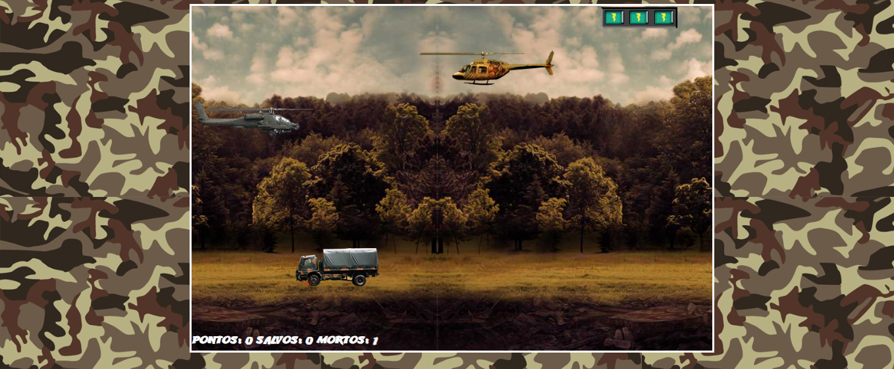

# RESGATE COM HELICOPTERO
🎮É UM JOGO SIMPLES DE AÇÃO E SOBREVIVÊNCIA NO QUAL VOCÊ CONTROLA UM HELICÓPTERO PARA RESGATAR ALIADOS ENQUANTO EVITA OU ENFRENTA INIMIGOS.

  

## DESCRIÇÃO:
É um jogo simples de ação e sobrevivência no qual você controla um helicóptero para resgatar aliados enquanto evita ou enfrenta inimigos. Seu objetivo é acumular pontos, salvar o maior número de aliados possível e sobreviver pelo maior tempo.

## COMO JOGAR?
- **Movimentação**:
  - Pressione a tecla **W** ou **↑ (Seta para cima)** para mover o helicóptero para cima.
  - Pressione a tecla **S** ou **↓ (Seta para baixo)** para mover o helicóptero para baixo.
- **Ataque**:
  - Pressione **D** ou **Espaço** para atirar nos inimigos.
- **Objetivo**:
  - Salve os aliados enquanto desvia ou destrói os inimigos.
  - Colete pontos ao eliminar inimigos e resgatar aliados.
- **Perigos**:
  - Evite colidir com inimigos ou deixar sua barra de energia esvaziar, o que resulta no fim do jogo.
- **Mecânicas adicionais**:
  - O jogo aumenta de dificuldade gradualmente com o aumento da velocidade dos inimigos.
- **Final do jogo**:
  - Se sua energia acabar, o jogo termina e exibe sua pontuação. Você pode clicar no botão para reiniciar e tentar novamente.

## NÃO SABE?
- Entendemos que para manipular arquivos em `HTML`, `CSS` e outras linguagens relacionadas, é necessário possuir conhecimento nessas áreas. Para auxiliar nesse aprendizado, oferecemos cursos gratuitos disponíveis:
* [CURSO DE HTML E CSS](https://github.com/VILHALVA/CURSO-DE-HTML-E-CSS)
* [CURSO DE JAVASCRIPT](https://github.com/VILHALVA/CURSO-DE-JAVASCRIPT)
* [CURSO DE JQUERY](https://github.com/VILHALVA/CURSO-DE-JQUERY)
* [CONFIRA MAIS CURSOS](https://github.com/VILHALVA?tab=repositories&q=+topic:CURSO)

## CREDITOS:
- [PROJETO CRIADO PELO "mfmuzi"](https://github.com/mfmuzi/DOOM)
- [PROJETO EDITADO PELO VILHALVA](https://github.com/VILHALVA)
